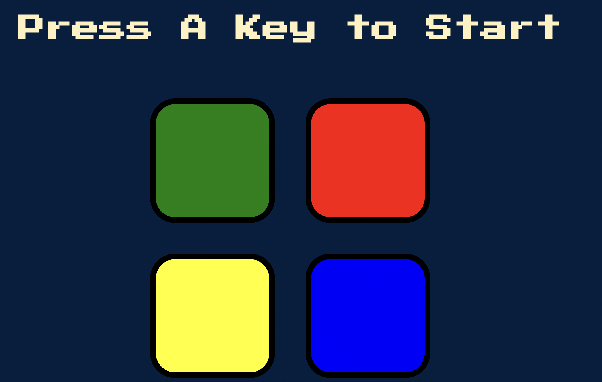
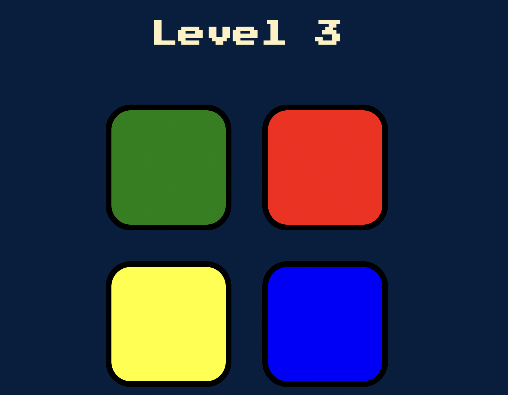
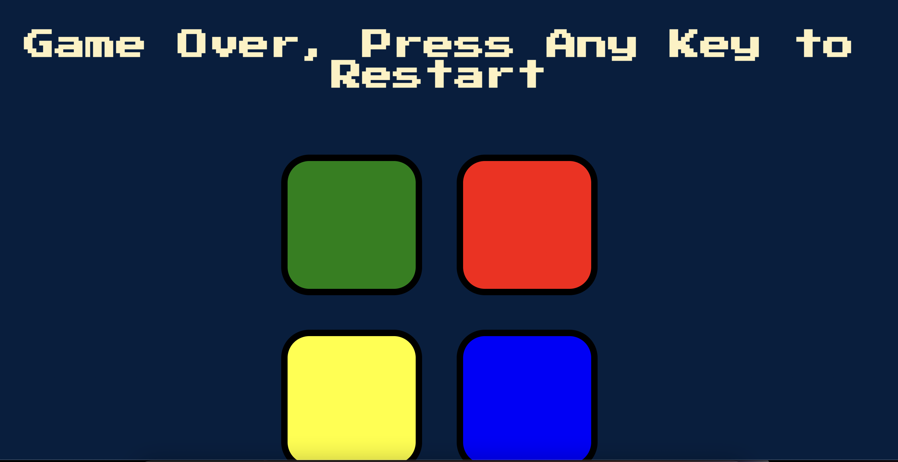

# Simon-Game
The object of the game is to repeat a series of random tile clicks created by the game. After each round, the sequence becomes progressively longer and more complex which makes it harder to remember.

## Start
You can download all the files to your local, and open index.html in your default browser. Or just simply click the link https://cindiddy.github.io/Simon-Game/

## Screenshots
###### 1) Press any key to start Page

###### 2) During the game page

###### 3) Game over page

